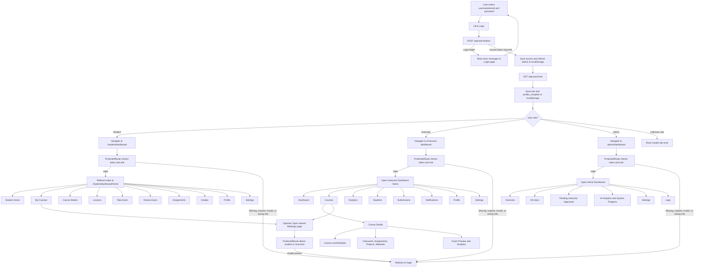

# Post-Login User Flow

This flowchart is based on the current login, route, and role-protection logic in the frontend app.

## Notes

- Failed login keeps the user on the login page and shows an error.
- Instructor accounts can also be blocked by approval or email-verification checks before access is granted.
- After login, every protected area validates the JWT token again before showing the page.
