# LMS System ERD

This ERD is based on the current Django models in `users_app`, `courses`, and `analytics_ai`.

```mermaid
erDiagram
    USER {
        int id PK
        string username
        string email
        string school_id
        string role
        string college
        boolean is_active
        boolean is_verified_school_user
        boolean is_email_verified
        boolean profile_complete
        string middle_initial
        string avatar
        string bio
        string phone
        string department
    }

    CATEGORY {
        int id PK
        string name
    }

    COURSE {
        int id PK
        int instructor_id FK
        int category_id FK
        string title
        string description
        string thumbnail
        date start_date
        time start_time
        string join_code
        boolean join_code_enabled
        datetime join_code_expiration
        boolean is_archived
        int assignments_count
    }

    MODULE {
        int id PK
        int course_id FK
        string title
        string description
        int order
        datetime created_at
    }

    LESSON {
        int id PK
        int course_id FK
        int module_id FK
        string title
        string content
        string description
        string file
        string extracted_text
        int order
        datetime uploaded_at
        datetime created_at
    }

    LESSONIMAGE {
        int id PK
        int lesson_id FK
        string image
        datetime created_at
    }

    LESSONCOMPLETION {
        int id PK
        int lesson_id FK
        int student_id FK
        datetime completed_at
    }

    ACTIVITYTYPE {
        int id PK
        string name
        float weight
        boolean requires_points
        boolean requires_due_date
    }

    COURSEACTIVITY {
        int id PK
        int course_id FK
        int activity_type_id FK
        string title
        string description
        string file
        string link
        datetime created_at
        datetime due_date
        boolean allow_late_submissions
        int points
        string grading_type
        string topic
        string question_type
        int quiz_time_limit_seconds
        int max_attempts
        boolean randomize_questions
        boolean randomize_choices
        int random_subset_size
        boolean require_answer_to_advance
        boolean anti_cheat_enabled
        boolean anti_cheat_tab_switch
        boolean anti_cheat_multi_tab
        boolean anti_cheat_disable_copy_paste
        boolean anti_cheat_fullscreen_required
        boolean show_score_immediately
        boolean allow_answer_review
        datetime availability_start
        datetime availability_end
        string assessment_type
        string publish_state
        boolean project_group_enabled
        json classwork_metadata
        json quiz_questions
        json quiz_sections
    }

    CLASSWORKDRAFT {
        int id PK
        int instructor_id FK
        int course_id FK
        string title
        string description
        string assessment_type
        datetime due_date
        datetime availability_start
        datetime availability_end
        int points
        int quiz_time_limit_seconds
        int max_attempts
        boolean randomize_questions
        boolean randomize_choices
        int random_subset_size
        boolean require_answer_to_advance
        boolean anti_cheat_enabled
        boolean anti_cheat_tab_switch
        boolean anti_cheat_multi_tab
        boolean anti_cheat_disable_copy_paste
        boolean anti_cheat_fullscreen_required
        string pre_exam_message
        string topic
        json sections
        json course_ids
        string imported_source_name
        datetime updated_at
        datetime created_at
    }

    ACTIVITYSUBMISSION {
        int id PK
        int activity_id FK
        int student_id FK
        string text_answer
        string link
        string status
        datetime submitted_at
        float grade
        string feedback
        boolean is_late
    }

    SUBMISSIONATTACHMENT {
        int id PK
        int submission_id FK
        int announcement_id FK
        string file
        datetime uploaded_at
    }

    QUIZATTEMPT {
        int id PK
        int student_id FK
        int quiz_id FK
        int graded_by_id FK
        float score
        float total_points
        json question_snapshot
        json answers
        json result_breakdown
        int correct_answers
        int incorrect_answers
        datetime started_at
        datetime last_activity_at
        datetime submitted_at
        int time_spent
        int suspicious_events
        boolean is_locked
        string lock_reason
        datetime force_submitted_at
        string status
        float override_score
        boolean is_overridden
        datetime graded_at
        json visibility_snapshot
    }

    QUIZATTEMPTANSWER {
        int id PK
        int attempt_id FK
        string question_id
        string question_text
        string question_type
        string student_answer
        float max_points
        float auto_score
        float manual_score
        float override_score
        string feedback
        string status
    }

    QUIZATTEMPTSCOREAUDIT {
        int id PK
        int attempt_id FK
        int actor_id FK
        string question_id
        float previous_score
        float new_score
        string note
        datetime created_at
    }

    QUIZSECURITYEVENT {
        int id PK
        int quiz_id FK
        int attempt_id FK
        int student_id FK
        string event_type
        json details
        datetime created_at
    }

    QUIZATTEMPTACKNOWLEDGEMENT {
        int id PK
        int attempt_id FK
        int quiz_id FK
        int student_id FK
        datetime ack_timestamp
        string ack_message
    }

    QUESTIONBANKITEM {
        int id PK
        int instructor_id FK
        int course_id FK
        string topic
        string difficulty
        json question_data
        datetime created_at
        datetime updated_at
    }

    COURSECOMMENT {
        int id PK
        int course_id FK
        int user_id FK
        string message
        datetime created_at
    }

    ACTIVITYCOMMENT {
        int id PK
        int activity_id FK
        int user_id FK
        string message
        string attachment
        datetime created_at
    }

    INSTRUCTORFEEDBACK {
        int id PK
        int course_id FK
        int student_id FK
        int rating
        string comment
        datetime created_at
    }

    ATTENDANCESESSION {
        int id PK
        int course_id FK
        int created_by FK
        date date
        string topic
        datetime created_at
    }

    ATTENDANCERECORD {
        int id PK
        int session_id FK
        int student_id FK
        int marked_by FK
        string status
        decimal points_earned
        datetime marked_at
    }

    MEETING {
        int id PK
        int course_id FK
        int created_by FK
        string title
        datetime scheduled_time
        string meeting_link
        datetime created_at
    }

    MEETINGATTENDANCE {
        int id PK
        int meeting_id FK
        int student_id FK
        datetime joined_at
    }

    GRADINGSCHEME {
        int id PK
        int course_id FK
        string grading_type
        float passing_grade
        json custom_config
    }

    GRADINGCOMPONENT {
        int id PK
        int scheme_id FK
        string name
        float weight
        json activity_ids
    }

    GRADINGCOMPONENTSCORE {
        int id PK
        int component_id FK
        int student_id FK
        float raw_score
        datetime updated_at
    }

    ENROLLMENTREQUEST {
        int id PK
        int course_id FK
        int student_id FK
        int reviewed_by FK
        string status
        datetime created_at
        datetime updated_at
        datetime reviewed_at
    }

    NOTIFICATION {
        int id PK
        int recipient_id FK
        int actor_id FK
        int course_id FK
        int activity_id FK
        int submission_id FK
        string event_key
        string title
        string message
        string notification_type
        boolean is_read
        datetime read_at
        datetime created_at
    }

    SITESETTINGS {
        int id PK
        boolean require_email_verification
        boolean allow_instructor_self_registration
        boolean allow_username_change
        string default_user_role
        int analytics_polling_interval
        float analytics_low_risk_max
        float analytics_medium_risk_max
        float analytics_high_risk_min
        float analytics_passing_grade
        int max_login_attempts
        datetime updated_at
    }

    ADMINLOG {
        int id PK
        int performed_by FK
        int target_user FK
        string action
        string description
        datetime timestamp
    }

    STUDENTANALYTICS {
        int id PK
        int student_id FK
        int course_id FK
        float average_grade
        float late_rate
        float missing_rate
        float engagement_score
        int total_submissions
        float grade_trend
        float risk_score
        string risk_level
        float probability_student_fails
        string prediction_source
        string risk_explanation
        datetime last_updated
    }

    COURSEANALYTICS {
        int id PK
        int course_id FK
        int total_students
        float average_grade
        float average_engagement
        int high_risk_students
        int medium_risk_students
        int low_risk_students
        datetime last_updated
    }

    USER ||--o{ COURSE : teaches
    CATEGORY ||--o{ COURSE : classifies
    USER }o--o{ COURSE : enrolls_in
    COURSE ||--o{ MODULE : has
    COURSE ||--o{ LESSON : has
    MODULE ||--o{ LESSON : groups
    LESSON ||--o{ LESSONIMAGE : contains
    LESSON ||--o{ LESSONCOMPLETION : tracks
    USER ||--o{ LESSONCOMPLETION : completes

    COURSE ||--o{ COURSEACTIVITY : contains
    ACTIVITYTYPE ||--o{ COURSEACTIVITY : classifies
    COURSEACTIVITY }o--o{ COURSE : assigned_to
    USER ||--o{ CLASSWORKDRAFT : creates
    COURSE ||--o{ CLASSWORKDRAFT : stores

    COURSEACTIVITY ||--o{ ACTIVITYSUBMISSION : receives
    USER ||--o{ ACTIVITYSUBMISSION : submits
    ACTIVITYSUBMISSION ||--o{ SUBMISSIONATTACHMENT : has
    COURSEACTIVITY ||--o{ SUBMISSIONATTACHMENT : announces

    COURSEACTIVITY ||--o{ QUIZATTEMPT : has
    USER ||--o{ QUIZATTEMPT : takes
    USER ||--o{ QUIZATTEMPT : grades
    QUIZATTEMPT ||--o{ QUIZATTEMPTANSWER : stores
    QUIZATTEMPT ||--o{ QUIZATTEMPTSCOREAUDIT : logs
    USER ||--o{ QUIZATTEMPTSCOREAUDIT : performs
    COURSEACTIVITY ||--o{ QUIZSECURITYEVENT : triggers
    QUIZATTEMPT ||--o{ QUIZSECURITYEVENT : records
    USER ||--o{ QUIZSECURITYEVENT : causes
    QUIZATTEMPT ||--o{ QUIZATTEMPTACKNOWLEDGEMENT : has
    COURSEACTIVITY ||--o{ QUIZATTEMPTACKNOWLEDGEMENT : belongs_to
    USER ||--o{ QUIZATTEMPTACKNOWLEDGEMENT : acknowledges

    USER ||--o{ QUESTIONBANKITEM : owns
    COURSE ||--o{ QUESTIONBANKITEM : scopes

    COURSE ||--o{ COURSECOMMENT : has
    USER ||--o{ COURSECOMMENT : writes
    COURSEACTIVITY ||--o{ ACTIVITYCOMMENT : has
    USER ||--o{ ACTIVITYCOMMENT : writes
    COURSE ||--o{ INSTRUCTORFEEDBACK : receives
    USER ||--o{ INSTRUCTORFEEDBACK : gives

    COURSE ||--o{ ATTENDANCESESSION : has
    USER ||--o{ ATTENDANCESESSION : creates
    ATTENDANCESESSION ||--o{ ATTENDANCERECORD : contains
    USER ||--o{ ATTENDANCERECORD : belongs_to
    USER ||--o{ ATTENDANCERECORD : marked_by

    COURSE ||--o{ MEETING : has
    USER ||--o{ MEETING : creates
    MEETING ||--o{ MEETINGATTENDANCE : tracks
    USER ||--o{ MEETINGATTENDANCE : joins

    COURSE ||--|| GRADINGSCHEME : uses
    GRADINGSCHEME ||--o{ GRADINGCOMPONENT : defines
    GRADINGCOMPONENT ||--o{ GRADINGCOMPONENTSCORE : stores
    USER ||--o{ GRADINGCOMPONENTSCORE : earns

    COURSE ||--o{ ENROLLMENTREQUEST : receives
    USER ||--o{ ENROLLMENTREQUEST : requests
    USER ||--o{ ENROLLMENTREQUEST : reviews

    USER ||--o{ NOTIFICATION : receives
    USER ||--o{ NOTIFICATION : triggers
    COURSE ||--o{ NOTIFICATION : relates_to
    COURSEACTIVITY ||--o{ NOTIFICATION : relates_to
    ACTIVITYSUBMISSION ||--o{ NOTIFICATION : relates_to
    USER ||--o{ ADMINLOG : performs
    USER ||--o{ ADMINLOG : targets

    USER ||--o{ STUDENTANALYTICS : has
    COURSE ||--o{ STUDENTANALYTICS : analyzes
    COURSE ||--|| COURSEANALYTICS : summarizes
```

## Notes

- `Course.students` is a many-to-many relationship between `USER` and `COURSE`.
- `CourseActivity.assigned_courses` is also a many-to-many relationship.
- This ERD is intentionally focused on the active system flow and excludes legacy or unused backend leftovers that are no longer part of the real app experience.
- `SiteSettings` is effectively a system-level singleton table even though it is modeled as a normal entity.
